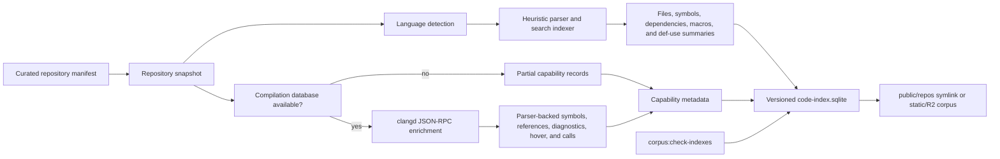
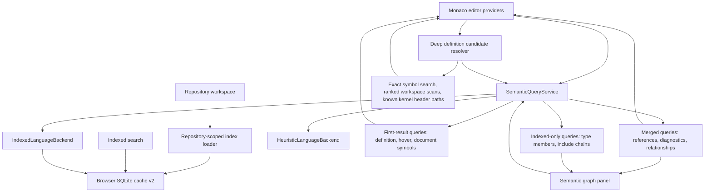
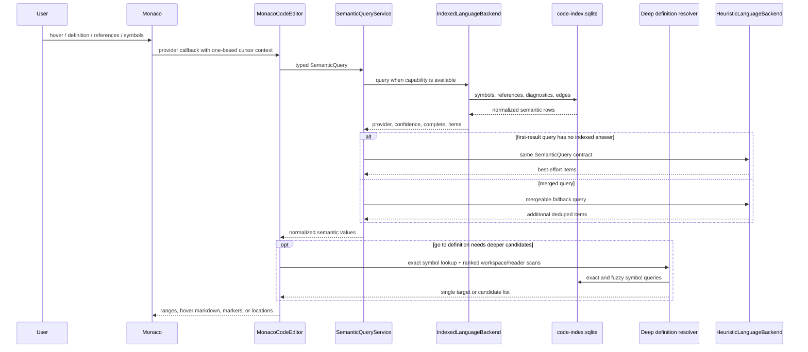

# [gitshaman.com](https://gitshaman.com)

[](https://discord.gg/fuXYz44tSs)

[](https://news.ycombinator.com/item?id=46066280)

GitShaman is a Next.js web application with a VS Code-like interface for browsing large source
repositories through curated guides, indexed search, cross-references, diagrams, and knowledge
checks.

Build a local copy of the GitShaman application. The setup downloads the required repository data to
your filesystem and builds a static shell that can run offline.

```bash
npm install
npm run dev      # starts at localhost:3000
```

Guide contributions are markdown-centered: edit or add files in `docs/`, start new guides from
`docs/_template.md`, and see `CONTRIBUTING.md` for the full workflow.

Cloudflare Pages builds set `CF_PAGES=1`, so `npm run build` skips the expensive corpus
generation phase and exports only the static shell. The shell loads repositories and indexes
from the configured public R2 origin. Set `EXPLORAR_SKIP_CORPUS_BUILD=0` to force a
full local corpus build. Local corpus indexing requires Node.js 22.22.2 or newer because it loads the
native `better-sqlite3` index builder.

Online you can visit **[https://gitshaman.com](https://gitshaman.com)** for free. For the niche URL-hacking workflow, replace `github.com` with `gitshaman.com` in a repository URL.

## Semantic Editor Implementation

The repository now has a static-first semantic editor path. Curated repositories are analyzed during
corpus generation, stored as versioned SQLite artifacts, and queried in the browser. The deployed
application does not start a language server for each visitor.

Implemented:

- Monaco definitions, references, hover, diagnostics, document symbols, cross-file models, and
  guarded call-hierarchy registration.
- Build-time `clangd` JSON-RPC enrichment using native or generated source-only compilation commands.
- Persisted compiler-backed references, symbol ranges, hover material, diagnostics, and call edges.
- Indexed include/import dependencies and bounded intraprocedural def-use summaries.
- A lazy semantic graph panel with Calls, Data flow, and Dependencies views.
- Provider and confidence metadata so compiler results and heuristic fallbacks remain distinguishable.
- Repository-scoped index loading shared by editor and search modes.
- A canonical semantic query contract and coordinator for editor requests, so fallback behavior is
  centralized instead of encoded separately in each Monaco provider.
- Build tooling that checks cached curated repositories have on-disk `code-index.sqlite` artifacts.

Current boundaries:

- C and C++ are the first compiler-backed languages. Python, TypeScript, and JavaScript continue to
  use indexed or heuristic navigation.
- Data flow is intraprocedural and best effort; it is not pointer-alias, interprocedural, or taint
  analysis.
- Repositories without a usable compilation database keep working with explicitly labeled fallback
  results.
- Monaco versions without the public call-hierarchy registration API use the semantic graph instead
  of exposing that native editor command.

### Offline indexing architecture



### Browser query architecture



### Semantic flow details

Monaco navigation is wired through a static-first query service. `MonacoCodeEditor` still owns the
editor lifecycle, event handlers, panels, and Monaco result conversion, but semantic fallback policy
lives in `SemanticQueryService`. The service registers `IndexedLanguageBackend` and
`HeuristicLanguageBackend` in deterministic order, checks backend capabilities, isolates provider
errors, and normalizes results from the canonical `SemanticQuery` contract.



Fallback behavior is explicit:

- Definitions, hover, and document symbols prefer indexed/parser-backed answers and fall back only
  when no indexed result exists.
- References and relationships merge indexed and heuristic results, then dedupe by stable location
  or graph-edge keys.
- Diagnostics come from backends that explicitly provide diagnostics; there is no synthetic
  heuristic diagnostic fallback.
- Type members and include chains use the indexed backend when available and otherwise return empty
  results.
- Deep definition navigation augments the service result with exact index searches, current-file
  symbols, ranked workspace scans, and known Linux helper header paths such as `include/linux/printk.h`,
  `include/linux/list.h`, and `include/linux/spinlock.h`.

The indexed query helper surface lives mostly in `src/lib/code-index.ts`:

- `searchCodeIndexFiles` searches indexed file paths and content.
- `searchCodeIndexSymbols` and `findCodeIndexSymbolsByName` find symbol rows and exact definitions.
- `getCodeIndexReferencesForSymbol` resolves persisted reference locations, optionally including
  the declaration.
- `getCodeIndexGraphNeighbors` returns file graph edges for calls, data flow, dependencies, and
  other relationships.
- `getCodeIndexGuideLinks` maps guide sections to indexed files, symbols, and lines.
- `searchCodeIndexConcepts` searches persisted concept records.
- `getCodeIndexDiagnostics` and `getCodeIndexCapabilities` expose backend metadata used by the
  editor to label confidence and availability.

NPM tooling keeps the local corpus and indexes aligned:

- `npm run corpus:sync` downloads curated repositories and writes SQLite indexes, skipping semantic
  enrichment for quick local refreshes.
- `npm run corpus:prepare-compilation-databases` prepares missing compilation databases in cached
  snapshots. Semantic indexing also prepares them automatically. Generated commands cover C, C++, and
  Objective-C source files and carry an explicit source-only marker; their capabilities are `partial`
  because native build flags, SDKs, and generated headers may be missing. Native databases in `build/`
  or `out/` take precedence. Snapshots without C-family sources are reported as not applicable.
  After preparing cached snapshots, use `npm run corpus:sync -- --reindex` to refresh semantic indexes.
- `npm run corpus:check-indexes` verifies cached curated repositories have saved `code-index.sqlite`
  artifacts.

## Roadmap

GitShaman should stay a guide-first source browser. The goal is to improve guides, search, graph
views, and editor navigation with structured indexing and language-aware retrieval, not to turn the
product into a chat-first tool.

For public web deployment, expensive analysis should happen in offline index builders. The browser
client and read-only query APIs should consume prebuilt source snapshots and semantic artifacts
rather than spawning per-user language-server sessions.

### Milestone 0: Index Foundation

- [x] Generate a SQLite code index for curated repository snapshots.
- [x] Store files, symbols, references, file edges, guide links, concept links, and search tables in
      the index schema.
- [x] Load and cache `code-index.sqlite` in the browser for static deployments.
- [x] Keep heuristic navigation available as a fallback when an index is missing or incomplete.

### Milestone 1: Editor Backend Abstraction

- [x] Add a live editor language backend interface keyed by `languageId`.
- [x] Wire Monaco definition, reference, and hover flows through the indexed backend before falling
      back to heuristics.
- [x] Provide indexed symbol, file, reference, graph-neighbor, guide-link, and concept query helpers.
- [x] Share one backend contract between offline indexing and live editor queries.
- [x] Implement backend-provided diagnostics and document symbols with heuristic fallback.

### Milestone 2: C / C++ Semantic Navigation

- [x] Integrate build-time `clangd` indexing for repositories with `compile_commands.json`.
- [x] Replace heuristic-only C/C++ navigation where persisted `clangd` data is available.
- [x] Support parser-backed hover, definitions, references, diagnostics, type/member traversal, and
      include chains.
- [ ] Validate on Linux, XNU, seL4, and CPython native runtime code.

### Milestone 3: Python Semantic Navigation

- [ ] Integrate `pyright` or `basedpyright` for Python indexing and editor queries.
- [ ] Resolve Python symbols across stdlib, tests, tools, and scripts.
- [ ] Support Python hover, definitions, references, and diagnostics through the backend path.

### Milestone 4: Graph Retrieval And Concepts

- [x] Persist basic file edges, guide links, and concept links in the index.
- [x] Add a contextual calls, data-flow, and dependency graph panel with provenance.
- [ ] Resolve guide mentions to multiple symbol candidates instead of only file paths.
- [ ] Add concept views that group docs, tests, headers, and implementations.
- [ ] Add scoped search tabs for files, symbols, and references.

### Milestone 5: CPython Mixed Traversal

- [ ] Connect `Include/*.h`, `Objects/*.c`, `Python/*.c`, `Lib/*.py`, `Lib/test/*.py`, `Tools/*.py`,
      and `docs/python_cpython.md` in one retrieval model.
- [ ] Make `PyObject`, `PyTypeObject`, and `PyDictObject` resolve correctly.
- [ ] Make a concept like `dict` jump across docs, tests, headers, implementations, constructors,
      and guide chapters.
- [ ] Prove the same retrieval model on Linux and XNU kernel code.

### Milestone 6: Optional Semantic Retrieval

- [ ] Add embeddings only after exact symbol and graph retrieval are strong.
- [ ] Keep semantic search additive; exact structural lookup remains the primary retrieval path.

### UX Backlog

- [ ] Deep-linkable file, line, and symbol URLs.
- [ ] File outline panel.
- [ ] Per-file metadata strip with language, size, source, and related guide sections.
- [x] Persist open tabs and workspace state locally.
- [ ] Side-by-side file compare for two refs or branches.
- [ ] Guide-aware navigation polish such as opening all files in a chapter.
- [ ] Subsystem map / architecture view.
- [ ] Blame and history overlays.
- [ ] Dependency graph explorer.
- [ ] API surface explorer.
- [ ] Version-aware guides.
- [ ] Ownership or maintainer overlays.
- [ ] Build-target awareness.
- [ ] Automatic interesting-files ranking.
